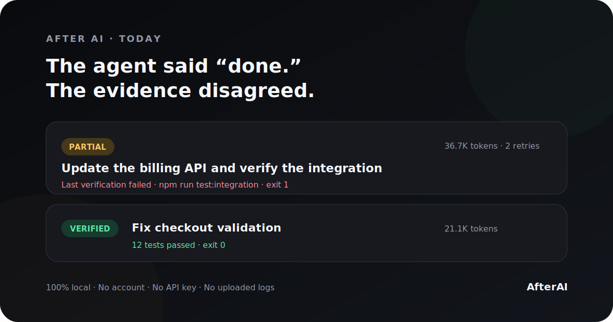

# AfterAI

> **Know what your AI actually did.**

Your coding agent says it finished. AfterAI checks the evidence.



```text
AFTER AI · TODAY
──────────────────────────────────────────────────────
Check one task — the evidence disagrees with the result.

◐ Partial  Update the billing API and verify the integration
  claude-opus-4.6 · 36.7K tokens · 2 retries

✓ Verified  Fix checkout validation and add a regression test
  gpt-5.6-sol · 21.1K tokens

NEXT
Review the billing task — its last verification failed.
```

**100% local. No account. No API key. No uploaded logs.**

## Try it in ten seconds

Requires Node.js 20 or newer.

```bash
npx github:chenjiatong1989-pixel/afterai --demo
```

The shorter `npx afterai` command will be enabled after the first npm release.

Or clone this early preview:

```bash
git clone https://github.com/chenjiatong1989-pixel/afterai.git
cd afterai
npm link
afterai --demo
```

Point it at local JSON or JSONL logs:

```bash
afterai --path ./my-agent-logs
afterai --path ./my-agent-logs --html
```

With no path, AfterAI looks for local Codex and Claude Code session directories. Missing or unreadable sources are skipped honestly.

## Why this is not another token dashboard

Token dashboards answer **“How much did the AI use?”**

AfterAI answers:

- What did it claim to finish?
- What can be verified from deterministic evidence?
- What failed or repeated?
- What needs your attention now?

An agent's statement is a claim. A passing test, successful build, file change, Git diff, or command exit code is evidence. AfterAI never treats those as the same thing.

## Five honest outcomes

| Outcome | Meaning |
| --- | --- |
| `✓ Verified` | Completion has deterministic verification evidence. |
| `◌ Unverified` | Work changed, but completion was not proven. |
| `◐ Partial` | Some work exists, but the last verification failed. |
| `✕ Failed` | The run failed without a completed result. |
| `? Unknown` | The logs do not contain enough reliable information. |

**Unknown is a feature.** AfterAI would rather admit missing evidence than invent a confident answer.

## Commands

```bash
afterai                    # today's local recap
afterai yesterday          # yesterday's recap
afterai week               # last seven days
afterai --path ./logs      # custom JSON/JSONL source
afterai --html             # also save afterai-report.html
afterai --json             # machine-readable output
afterai --demo             # evidence-backed sample
```

## How it works

```text
Local logs → normalized facts → deterministic evidence → honest recap
```

The analyzer uses program rules for:

- command exit codes
- test/build/lint results
- changed files
- repeated errors and commands
- model names and token usage when present

No LLM is required. A future optional narrator may turn already-established facts into smoother prose, but it will never be allowed to alter statuses or numbers.

## Privacy

- Logs stay on your computer.
- No account or API key is required.
- No network request is made by the CLI.
- HTML reports are static local files.
- Missing values remain `Unknown`.

Raw AI logs can contain prompts, source code, paths, and secrets. Treat exported JSON and HTML as private unless you have reviewed them.

## Current scope

This is an early, deliberately small preview. It reads common JSON/JSONL shapes and auto-detects the standard local Codex and Claude Code session locations. Log formats change, so real anonymized fixtures and adapter contributions are welcome.

The first milestone is accuracy for two tools—not shallow support for twenty-seven.

## Principles

1. Show conclusions before detail.
2. Separate claims from evidence.
3. Never disguise estimates as exact values.
4. Never spend more AI tokens just to count AI tokens.
5. Surface one next action, not ten weak suggestions.
6. The machine watches continuously so the human does not have to.

See [docs/PRODUCT.md](docs/PRODUCT.md) for the product boundary and roadmap.

## Contributing

See [CONTRIBUTING.md](CONTRIBUTING.md). The most useful early contributions are anonymized log fixtures, parser tests, and false-positive reports.

## License

MIT
